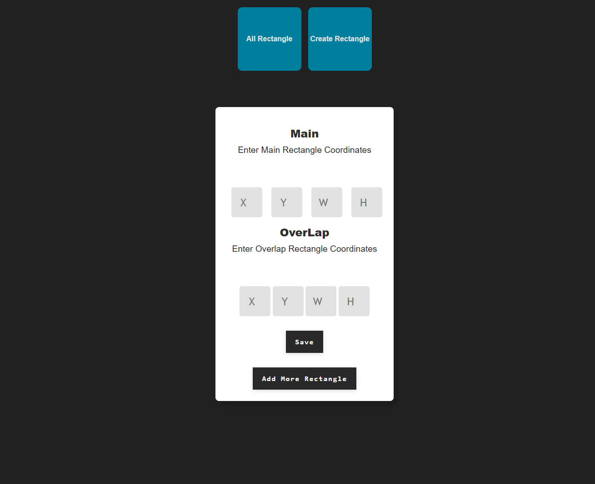
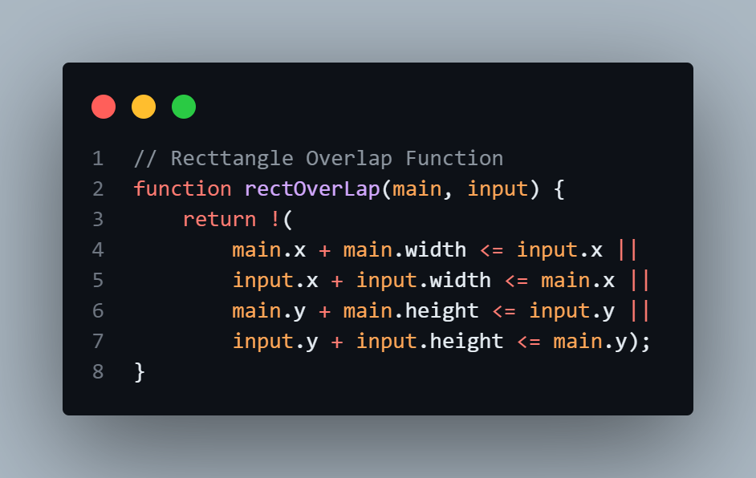
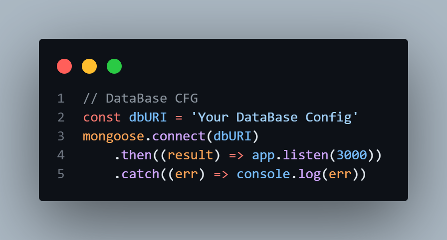

## Titles

- [About](#about)
- [Packages](#packages)
- [What This App Can Do](#what-this-app-can-do)
- [How It Works](#how-it-works)
- [Database](#database)
- [Run](#run)
- [Outro](#outro)


## About

I used these languages ​​to configure this application as much as I could.
`css` and `Js` for use by users and `Node.js` for its backend and server side. 
The structure used in this program is `MVC` structure.
I used `System Routing` for clean coding and faster access, as well as for easy configuration.
I used `Comments` as much as I could to make editing inside the codes easier as well as readability and access.
I also used `Ejs View Engine` to use dynamic code inside `Html`


## Packages

Before you start using this program, be sure to follow these steps to install all the packages you need to run it:


+ [Express](https://www.npmjs.com/package/express)
```
$ npm i express
```
+ [Ejs](https://www.npmjs.com/package/ejs)
```
$ npm i ejs
```
+ [Mongoose](https://www.npmjs.com/package/mongoose)
```
$ npm i mongoose
```
+ [Nodemon](https://www.npmjs.com/package/nodemon)
```
$ npm i nodemon
```

 


## What This App Can Do

This program can compare the coordinates of a rectangle as the main rectangle with all the other coordinates you enter.
If any coordinate overlaps with the original rectangle, it will be stored in your database, and if the entered information does not match the original rectangle, it will be ignored and not saved.
The coordinates of the rectangle that you need to enter include x, y, width, height of the rectangles. 
You can add as many sub-rectangles as you want and check their overlap with the main rectangle.
Also, if all the coordinates you entered do not match the original rectangle, the try again page will be displayed for you.





## How It Works
Using a function called `rectOverLap`, this program calculates the commonality of the entered rectangles with the main rectangle, if there is an overlap, the coordinates are stored in the database, otherwise it is ignored.



## Database
I have chosen the `mongoDB` database for this project and have included a section to put your own database configuration




## Run

Use the `nodemon` package to run this program better.
This program runs on port number `3000`.
Use this command to run the program:
```
$ nodemon app.js
```


## Outro
I hope you enjoy this program and I also hope you can use it in your projects.


`Built With :)`
